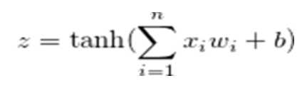
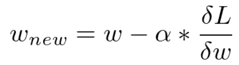
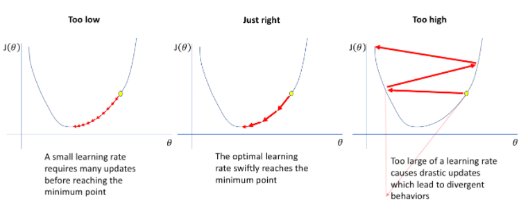
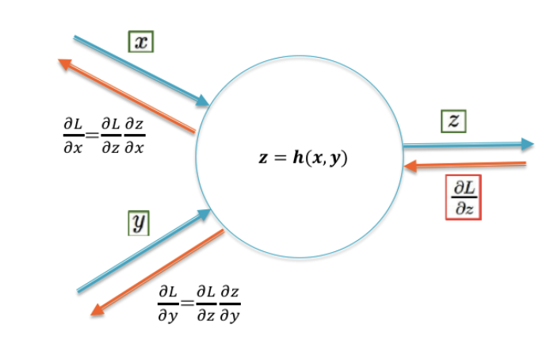
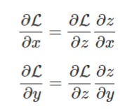

## **What is a neural network neuron?**

Neurons are the nodes which act as a small memory storage or signal. These neurons have input and output connections (weights). The input can either come from raw dataset or from the neurons positioned at the previous layer of neural net.

A neuron consists of a set of weights(wi) and an activation function and receives a set of inputs(xi). The neuron computes the weighted sum of these inputs, and this sum is passed through a nonlinear function called activation function to generate the output. The output of the neuron can be sent as input to the neurons of another layer or it could be the actual output of the neural network.

Let there be n inputs to the neuron, the output can be represented as :

where , b = bias of the neuron

## **What is the use of the learning rate?**

We train our neural network using stochastic gradient descent algorithms. Stochastic gradient descent is an optimization algorithm that estimates the error gradient for the current state of the model then updates the weights of the model using backpropagation. The amount these weights are updated during the training is called as the learning rate or the step. In the below formula **α** is the learning rate.

Now, how do we decide the value of learning rate ? The smaller learning rate will result in very small updation in the weights and our model will take a lot of time to train and learn the optimal weights, and, a higher learning rate results in rapid changes and often results in a sub-optimal final set of weights .

A desirable learning rate is low enough that the network converges to something useful, but high enough that it can be trained in reasonable time. Generally the learning rate is between 0 and 1.

### **How are weights initialized?**

The aim of weight initialization is to prevent layer activation outputs from exploding or vanishing during the course of a forward pass through a deep neural network. If either occurs, loss gradients will either be too large or too small to flow backwards beneficially, and the network will take longer to converge, if it is even able to do so at all.

The most used weight initialization techniques are described as follows

| **Initialization method** | **Explanation** | **Pros.** | **Cons.** |
| --- | --- | --- | --- |
| **All-zeros initialization and Constant initialization** | This method sets all weights to zeros (respectively to constant). Also, all activations in all neurons are the same, and therefore all calculations are the same, making which makes the concerned model a linear model | Simplicity | Symmetry problem leading neurons to learn the same features |
| **Random initialization** | This technique improves the symmetry-breaking process and provides much greater precision. The weights are initialized very near to zero and randomly. This method prevents from learning the same feature for input parameters | Improves the symmetry-breaking process | - A saturation may occur leading to a vanishing gradient - The slope or gradient is small, which can cause the gradient descent to be slow |
| **LeCun initialization : normalize variance** | LeCun initialization aims to prevent the vanishing or explosion of the gradients during the backpropagation by solving the growing variance with the number of inputs and by setting constant variance. | Solves growing variance and gradient problems | - Not useful in constant-width networks - Takes into account the forward propagation of the input signal - This method is not useful when the activation function is non-differentiable |
| **Xavier initialization (Glorot initialization)** | Xavier proposed a more straightforward method, where the weights such as the variance of the activations are the same across every layer. This will prevent the gradient from exploding or vanishing. | Decreases the probability of the gradient vanishing/exploding problem | - This method is not useful when the activation function is non-differentiable - Dying neuron problem during the training |
| **He initialization (Kaiming initialization)** | This initialization preserves the non-linearity of activation functions such as ReLU activations. Using the He method, we can reduce or magnify the magnitudes of inputs exponentially | Solves dying neuron problems | - This method is not useful for layers with differentiable activation function such as ReLU or LeakyReLU |

## **What is &quot;loss&quot; in a neural network?**

Loss is the error in the predicted output by our model and the ground truth. And the method to calculate this loss is called loss function. Loss is the very important component in the neural network as loss is used to calculate the gradient and the gradients are used to update the weight of the neural network.

Few of the essential loss functions, which could be used for most of the objectives.

**Mean Squared Error (MSE)** - **MSE** loss is used for regression tasks. As the name suggests, this loss is calculated by taking the mean of squared differences between actual(target) and predicted values.

**Binary Crossentropy (BCE) – BCE** loss is used for the binary classification tasks. If you are using BCE loss function, you just need one output node to classify the data into two classes. The output value should be passed through a _sigmoid_ activation function and the range of output is (0 – 1).

**Categorical Crossentropy (CC)** – When we have a multi-class classification task, one of the loss function you can go ahead is this one. If you are using CCE loss function, there must be the same number of output nodes as the classes. And the final layer output should be passed through a _softmax_ activation so that each node output a probability value between (0–1).

**Sparse Categorical Crossentropy (SCC)** – This loss function is almost similar to CCE except for one change. When we are using SCCE loss function, you do not need to one hot encode the target vector. If the target image is of a cat, you simply pass 0, otherwise 1. Basically, whichever the class is you just pass the index of that class.

## **What is the &quot;chain rule&quot; in gradient flow?**

If a variable _z_ depends on the variable _y_, which itself depends on the variable _x_, so that _y_ and _z_ are dependent variables, then _z_, via the intermediate variable of _y_, depends on _x_ as well. This is called chain rule and mathematically it can be expressed as -

Let&#39;s Look at an example

The figure shows a node with inputs (x,y) and output z=h(x,y), where h represents the function performed at the node. Let&#39;s assume that the gradient ∂L/∂z is known. Using the Chain Rule of Differentiation, the gradients ∂L/∂x and ∂L/∂y can be computed as:

This rule can be used to compute the effect of the node on the gradients flowing back from right to left.
